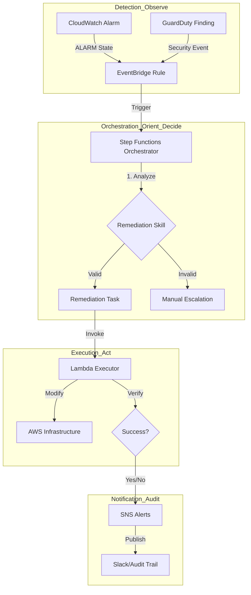

# AWS Automated Remediation Pipeline

**Event-Driven Incident Response & Cloud Operations Automation**

[](https://python.org)&nbsp;[](https://terraform.io)&nbsp;[](https://github.com/features/actions)

This repository implements a production-grade, event-driven remediation system on AWS. It automates the detection, isolation, and resolution of common infrastructure failures and security threats, reducing MTTR (Mean Time To Resolution) from minutes to seconds.
## Architecture

The system implements an automated OODA loop (Observe-Orient-Decide-Act) using cloud-native primitives:



### Technical Philosophy: The OODA Loop for Cloud Operations

In high-pressure production environments, manual incident response is a bottleneck. This pipeline codifies the decision-making process into an automated, stateful workflow:

- **Stateful Orchestration:** Unlike stateless Lambda-only approaches, using AWS Step Functions ensures that incident state is maintained. If a remediation task fails, the system handles retries with exponential backoff and provides a deterministic path for manual intervention.
- **Skill-Based Logic:** By decoupling remediation playbooks into structured Markdown "Skills," the system remains extensible. Adding a new remediation capability requires updating a playbook rather than refactoring core orchestration logic.
- **Least-Privilege Security:** The execution layer is strictly scoped. The remediation Lambda possesses only the permissions required to modify the specific resources identified in the trigger, reducing the blast radius of the automation itself.
- **Zero-Trust Deployment:** Infrastructure is managed via GitHub Actions using OIDC, eliminating the need for long-lived IAM credentials in CI/CD.

## Technical Arsenal

- **Infrastructure as Code:** Terraform (Modular, DRY architecture)
- **State Management:** AWS Step Functions (ASL)
- **Logic Layer:** Python 3.11 (Boto3)
- **Validation:** Checkov (SCA), Trivy (Vulnerability Scanning)
- **Identity:** OIDC / IAM (Least-privilege)
- **Observability:** CloudWatch, EventBridge, SNS

## Getting Started

### Prerequisites

- AWS CLI configured with appropriate permissions.
- Terraform >= 1.5.0 installed.
- Python 3.11 installed.

### Deployment

1.  **Initialize Remote State:**
    Run the Terraform configuration in `modules/global/state.tf` to create the S3 bucket and DynamoDB table for state management.

2.  **Configure OIDC:**
    Deploy the OIDC module in `modules/global/oidc.tf` to establish the trust relationship between GitHub and AWS.

3.  **Deploy Environment:**
    Navigate to `environments/dev` and execute:
    ```bash
    terraform init
    terraform apply
    ```

### Simulation

To test the remediation loop without a real incident, use the provided simulation script:
```bash
python tests/simulate_incident.py --sfn-arn <STATE_MACHINE_ARN> --instance-id <INSTANCE_ID>
```

## Implementation Roadmap

See [ROADMAP.md](./ROADMAP.md) for a detailed phase-by-phase breakdown.

---
Operations and Reliability Engineered (c) 2026 Harrison Vance.
